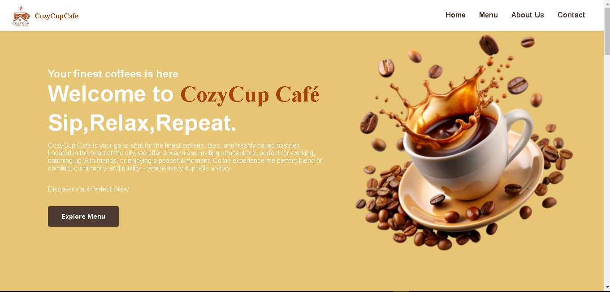
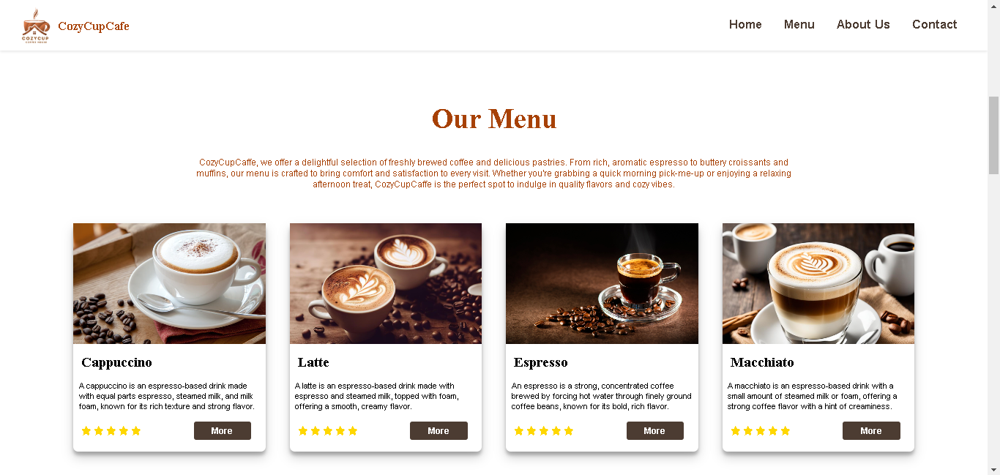
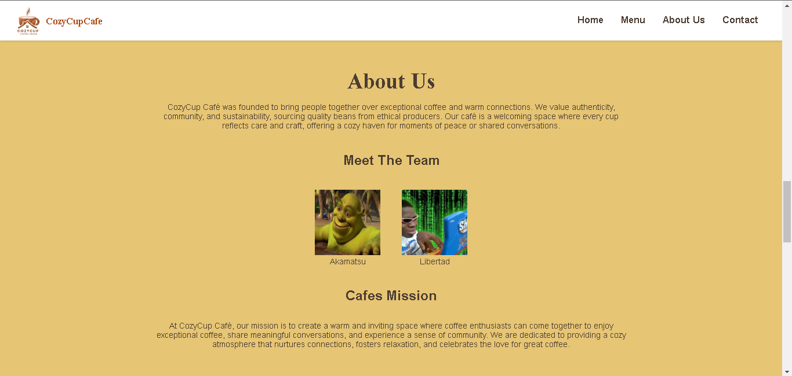
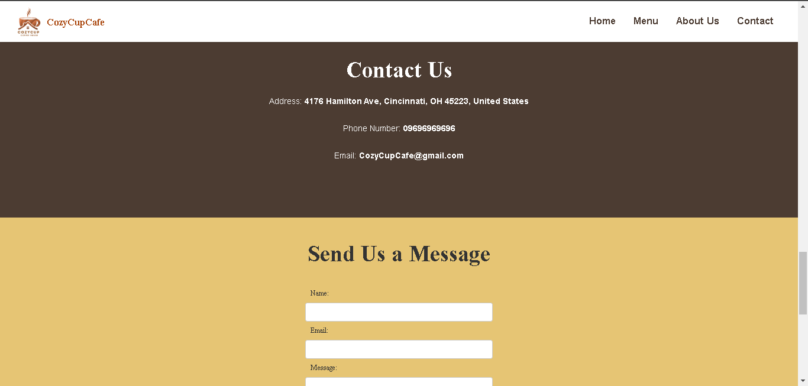

<<<<<<< HEAD
# Cozy Cup Café

## Project Description
Cozy Cup Café is a modern café website designed to showcase the menu, ambiance, and services of the café. It features a user-friendly interface that highlights the café’s offerings and provides a seamless browsing experience for customers.

## Features
- Showcase of curated coffee and tea menus
- Image gallery of the café’s ambiance
- Contact form for customer inquiries
- Interactive location map

## Screen Captures

### Homepage showcasing the menu and welcome message

### Image gallery displaying the menu's ambiance of the café

### About Us information of the coffeeshop section

### Contact page with a form for inquiries and an interactive map

## About the Authors

**Main Creator Name:** John Lenard Libertad 
**Email:** yuzonallen02@gmail.com

  <!-- Facebook Icon -->
  <a href="https://www.facebook.com/johnlenard.libertad.9/" target="_blank" style="text-decoration: none;">
    <svg xmlns="http://www.w3.org/2000/svg" width="32" height="32" viewBox="0 0 24 24" fill="white">
      <path d="M22.675 0h-21.35c-.732 0-1.325.593-1.325 1.326v21.348c0 .733.593 1.326 1.326 1.326h11.495v-9.294h-3.128v-3.622h3.128v-2.671c0-3.1 1.893-4.788 4.656-4.788 1.324 0 2.462.099 2.795.143v3.241l-1.917.001c-1.504 0-1.796.715-1.796 1.764v2.31h3.587l-.467 3.622h-3.12v9.293h6.116c.733 0 1.326-.593 1.326-1.326v-21.35c0-.732-.593-1.325-1.326-1.325z"/>
    </svg>
  </a>

  <!-- GitHub Icon -->
  <a href="https://github.com/JohnLicode" target="_blank" style="text-decoration: none;">
    <svg xmlns="http://www.w3.org/2000/svg" width="32" height="32" viewBox="0 0 24 24" fill="white">
      <path d="M12 .297c-6.63 0-12 5.373-12 12 0 5.302 3.438 9.8 8.205 11.385.6.113.82-.258.82-.577v-2.247c-3.338.726-4.033-1.415-4.033-1.415-.546-1.387-1.333-1.756-1.333-1.756-1.09-.745.083-.73.083-.73 1.205.084 1.838 1.236 1.838 1.236 1.07 1.835 2.809 1.305 3.495.998.108-.775.418-1.305.76-1.605-2.665-.303-5.466-1.332-5.466-5.93 0-1.31.467-2.382 1.236-3.222-.124-.303-.535-1.523.117-3.176 0 0 1.008-.322 3.301 1.23.957-.266 1.982-.399 3.003-.405 1.021.006 2.047.139 3.006.405 2.287-1.552 3.295-1.23 3.295-1.23.655 1.653.244 2.873.12 3.176.77.84 1.231 1.912 1.231 3.222 0 4.61-2.805 5.624-5.475 5.922.429.369.812 1.096.812 2.21v3.285c0 .32.216.694.825.576 4.765-1.586 8.198-6.084 8.198-11.384 0-6.627-5.373-12-12-12z"/>
    </svg>
  </a>

**Collaborator Name:** Hidenori Joshua Akamatsu  
**Email:** joshuaakamatsu18@gmail.com

  <!-- Facebook Icon -->
  <a href="https://www.facebook.com/hidenorijoshua.akamatsu.3" target="_blank" style="text-decoration: none;">
    <svg xmlns="http://www.w3.org/2000/svg" width="32" height="32" viewBox="0 0 24 24" fill="white">
      <path d="M22.675 0h-21.35c-.732 0-1.325.593-1.325 1.326v21.348c0 .733.593 1.326 1.326 1.326h11.495v-9.294h-3.128v-3.622h3.128v-2.671c0-3.1 1.893-4.788 4.656-4.788 1.324 0 2.462.099 2.795.143v3.241l-1.917.001c-1.504 0-1.796.715-1.796 1.764v2.31h3.587l-.467 3.622h-3.12v9.293h6.116c.733 0 1.326-.593 1.326-1.326v-21.35c0-.732-.593-1.325-1.326-1.325z"/>
    </svg>
  </a>

  <!-- GitHub Icon -->
  <a href="https://github.com/Izayoi18" target="_blank" style="text-decoration: none;">
    <svg xmlns="http://www.w3.org/2000/svg" width="32" height="32" viewBox="0 0 24 24" fill="white">
      <path d="M12 .297c-6.63 0-12 5.373-12 12 0 5.302 3.438 9.8 8.205 11.385.6.113.82-.258.82-.577v-2.247c-3.338.726-4.033-1.415-4.033-1.415-.546-1.387-1.333-1.756-1.333-1.756-1.09-.745.083-.73.083-.73 1.205.084 1.838 1.236 1.838 1.236 1.07 1.835 2.809 1.305 3.495.998.108-.775.418-1.305.76-1.605-2.665-.303-5.466-1.332-5.466-5.93 0-1.31.467-2.382 1.236-3.222-.124-.303-.535-1.523.117-3.176 0 0 1.008-.322 3.301 1.23.957-.266 1.982-.399 3.003-.405 1.021.006 2.047.139 3.006.405 2.287-1.552 3.295-1.23 3.295-1.23.655 1.653.244 2.873.12 3.176.77.84 1.231 1.912 1.231 3.222 0 4.61-2.805 5.624-5.475 5.922.429.369.812 1.096.812 2.21v3.285c0 .32.216.694.825.576 4.765-1.586 8.198-6.084 8.198-11.384 0-6.627-5.373-12-12-12z"/>
    </svg>
  </a>

=======
# CozyCupCaffe by Libertad and Akamatsu
>>>>>>> f156bbdef421c300e0b4ba4821a48b1994c9c613
